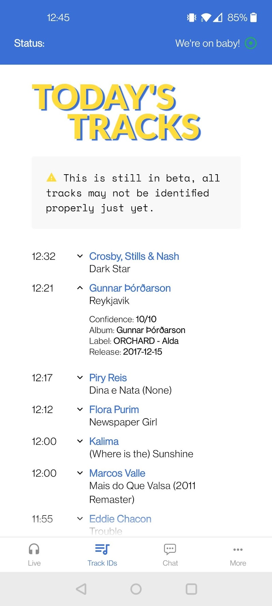

# Do!!You!!!World app

Official app for https://doyou.world/ , built with React Native, AirTime Pro's API & a lot of coffee.

Feel free to create issues [here](https://github.com/Jojocaster/do-you-app/issues) to report bugs / suggest features, I'll do my best to get back to you asap.

Bug tracker for non-GitHub users: [Google Form](https://forms.gle/5HYMW6AM7vtAZ1QP6)

## Table of contents
* [Features](#features)
* [Roadmap](#roadmap)
* [Screenshots](#screenshots)
* [Changelog](#changelog)
* [Known Bugs / Troubleshooting](#known-bugs)

## Features
- Live Status tracker, running automatically in the background
- See the list of upcoming shows (according to current timezone)
- Allow radio to be played in the background & controlled from the notification centre & lockscreen
- See today's track IDs (Beta)
- Receive notifications when a show is live (Beta)
- Control app volume separately from OS
- Dark & light themes
- Chat!

## Screenshots
<p align="center">

&nbsp; &nbsp; &nbsp; &nbsp;

&nbsp; &nbsp; &nbsp; &nbsp;

&nbsp; &nbsp; &nbsp; &nbsp;

</p>

<p align="center">

&nbsp; &nbsp; &nbsp; &nbsp;

&nbsp; &nbsp; &nbsp; &nbsp;
</p>

## Roadmap
- UI & UX improvements
- Add animation when show is playing
- Fetch current track in background and update "now playing" 
- Add "Archives" tab
- Improve splash screen
- Link track IDs to archives
- 11:11
- Support tablets
- Add "Events" tab
- Better error management :)
- Allow users to save tracks to favourites
- Improve test coverage
- Remove useless packages (e.g. styled-components)

### Done
<del>- Trigger push notifications from server instead of polling data from client (using `Lambda`, `CRON`, `S3` & `expo-notifications`)</dev>
- <del>Fetch live info in the background to send notifications when shows are live</del>
- <del>Add volume control</del>
- <del>Add Settings to manage alerts</del>
- <del>Show correct times according to timezone</del>
- <del>Embed chat</del>
- <del>Handle light theme</del>
- <del>Persist state in async store</del>
- <del>iOS release</del>
- <del>Display more information about tracks</del>
- <del>Prevent app from going to sleep is chat is focused</del>
- <del>Persist cookies from Minnit</del>

<strong>Open to suggestions, feel free to post them [here](https://github.com/Jojocaster/do-you-app/issues) :)</strong>

## Changelog

- 0.3.1: [Android](https://play.google.com/store/apps/details?id=com.wonkylines.doyouworld) - [iOS](https://apps.apple.com/gb/app/do-you-world/id1620769718)
```
- Copy added to TrackIDs
- MoreScreen copy updated, now showing DoYouWorld's ko-fi
- Player now checks the show API for artwork to make lockscreen / controls more dynamic, reverts to default image if undefined 
- Battery saver added to settings
- Player now uses local state from RNTP
- Player state detection improved for both iOS & Android
- Multiple components memoized to improve perfs
- Track reset when resuming from pause to empty buffer
- Tests added
- GA code added to stream headers to recover stats
- General clean up
```

- 0.3.0: [Android](https://play.google.com/store/apps/details?id=com.wonkylines.doyouworld) - [iOS](https://apps.apple.com/gb/app/do-you-world/id1620769718)
```
- State now persisted in AsyncStorage
- Light / dark theme implemented
- Player behaviour improved on both platforms 
- HTML characters escaped from shows names
- Volume control added - player can now manage volume separately from OS
- Manual refresh added to chat
- Chat auto-reload only triggered when process is killed in the background
- Tracks details added, new endpoint implemented
- Tracks screen made scrollable to support more items
```

- 0.2.3: [Android](https://play.google.com/store/apps/details?id=com.wonkylines.doyouworld) - [iOS](https://apps.apple.com/gb/app/do-you-world/id1620769718)
```
- Settings improved
- Overall style improvements
- App & deployment config updated
- Chat view added
- Player behaviour improved on iOS
```

- Beta 0.2.2: [Android](https://github.com/Jojocaster/do-you-app/releases/download/v0.2.2/a0a4ea6f-8afe-4995-85fb-1686f9b50878-9ff2763ce3b94445894895eb25765993.apk)
```
- Fix for player. It would sometimes lose the current track when the app was idle in the background for too long. 
```

- Beta 0.2.1: [Android](https://github.com/Jojocaster/do-you-app/releases/download/v0.2.1/bc0cbc31-cd68-4fa7-b95c-5b22689e35c4-b5212c5713e249a0abc2a4431559d084.apk)
```
- Current show / track logic improved
- Current show now highlighted in schedule
- Schedule now supports different timezones
- Code cleaned up and improved
```

- Beta 0.2.0: [Android](https://github.com/Jojocaster/do-you-app/releases/download/v0.2.0/44fb928c-12a5-4d20-bcc9-1b8aae1c02c7-39a1768725d54e5ba882c932e7b5dcf3.apk)
```
- Notifications can now be sent when a show is live and can be turned on & off from the Settings.
- Current show's title grabbed from schedule in case `live-info` doesn't return the right name
- Player controls improved
- Minor fixes 
```

- Beta 0.1.0: [Android](https://github.com/Jojocaster/do-you-app/releases/download/v0.1.0/b883bc47-bfbb-483e-a960-6439cc2148e6-41c9ea09d631423b8a98bb9c8cf39d0d.apk)

/!\ As this version is still a beta and not on the store just yet, Google may warn you about the app being "unsafe" - that is completely normal. Just "install anyway" and enjoy that perfect sound forever.

## Known bugs
* <strong>AirPlay keeps dropping:</strong> There is a known a bug on the library we're using to manage streams (described [here](https://github.com/doublesymmetry/react-native-track-player/issues/1408)). The bug seems to have been introduced on iOS 15.3 - we will update the app once this is sorted.

* <strong>Google Cast:</strong> There is no current support for Google Cast. This might change in the future, but further work on the library mentioned above is needed before we can support it.

* <strong>Notifications don't work properly:</strong> Notifications are currently in beta. We are using local notifications, which means that the app checks for live status and tries to notify users when a new show is live. However, Android tends to kill the process if the app is in the background. iOS can also be unpredictable and limit background processes to run only every 15 minutes. 
We will move to push notifications shortly, which should solve this issue. 
