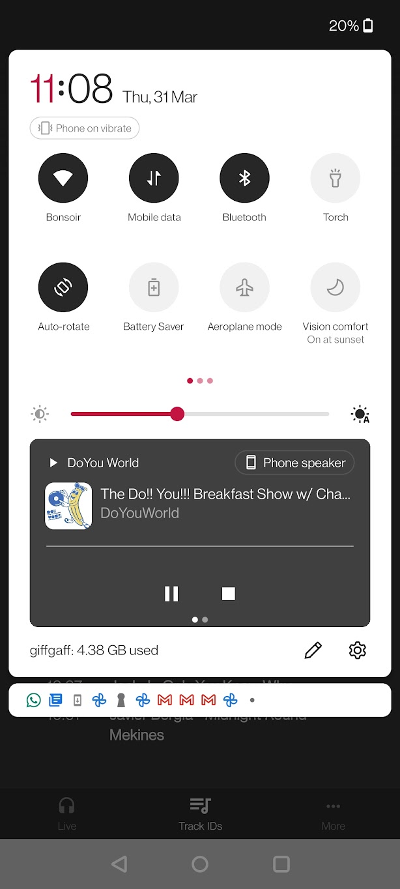

# DoYou?

Unofficial app for https://doyou.world/ , built with React Native, AirTime Pro's API & a lot of coffee.

Feel free to create issues [here](https://github.com/Jojocaster/do-you-app/issues) to report bugs / suggest features, I'll do my best to get back to you asap.

## Releases (Android)
- Beta 0.2.1: [Download link](https://turtle-v2-artifacts.s3.amazonaws.com/android/bc0cbc31-cd68-4fa7-b95c-5b22689e35c4-b5212c5713e249a0abc2a4431559d084.apk)
```
Changelog: 

- Current show / track logic improved
- Current show now highlighted in schedule
- Schedule now supports different timezones
- Code cleaned up and improved
```

- Beta 0.2.0: [Download link](https://turtle-v2-artifacts.s3.amazonaws.com/android/44fb928c-12a5-4d20-bcc9-1b8aae1c02c7-39a1768725d54e5ba882c932e7b5dcf3.apk)
```
Changelog: 

- Notifications can now be sent when a show is live and can be turned on & off from the Settings.
- Current show's title grabbed from schedule in case `live-info` doesn't return the right name
- Player controls improved
- Minor fixes 
```

- Beta 0.1.0: [Download link](https://expo.dev/accounts/joelbeaudon/projects/DoYouWorld/builds/fe33a6dc-e470-4270-978c-33fd50b119be)

/!\ As this version is still a beta and not on the store just yet, Google may warn you about the app being "unsafe" - that is completely normal. Just "install anyway" and enjoy that perfect sound forever.

## Features
- Live Status tracker, running automatically in the background
- Displays the list of upcoming shows according to timezone
- Allow radio to be played in the background & controlled from the notification centre & the lockscreen
- Display current show's Track IDs (Beta)
- Send notifications when a show is live

## Screenshots
<p align="center">

&nbsp; &nbsp; &nbsp; &nbsp;

&nbsp; &nbsp; &nbsp; &nbsp;

&nbsp; &nbsp; &nbsp; &nbsp;

</p>

## Roadmap
- UI & UX improvements
- Trigger push notifications from server instead of polling data from client (using `Lambda`, `CRON`, `S3` & `expo-notifications`)
- <del>Fetch live info in the background to send notifications when shows are live</del>
- 11:11
- Display tracks covers
- <del>Add Settings to manage alerts</del>
- <del>Show correct times according to timezone</del>
- Load shows from Mixcloud through Redis?
- Track ID archive
- Add "Events" tab
- Handle light theme?
- Set alerts for individual shows based on schedule?
- Better error management :)
- iOS release
- Persist state
- Embed chat? 
- Open to suggestions, feel free to post them here [here](https://github.com/Jojocaster/do-you-app/issues) :) 
